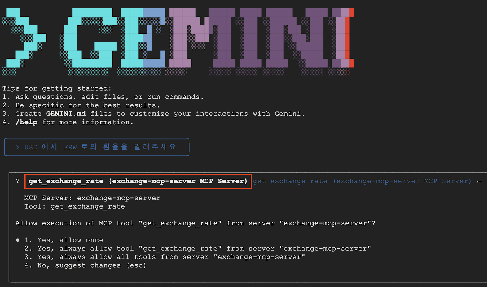
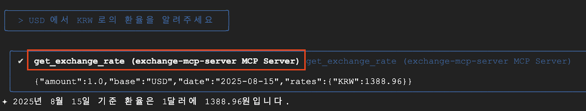

# Currency MCP Server 💵

Frankfurter API를 사용하여 환율 정보를 제공하는 간단한 MCP 서버입니다.

## Cloud Run 에 MCP 서버 배포
1. **API 활성화 (Cloud Run, Artifact Registry, Cloud Build)**
```bash
gcloud services enable \
  run.googleapis.com \
  artifactregistry.googleapis.com \
  cloudbuild.googleapis.com
```

2. **Cloud Run 에 배포**
```bash
gcloud run deploy currency-mcp-server \
    --no-allow-unauthenticated \
    --region=us-central1 \
    --source=.
```

## Cloud Shell 의 Gemini CLI 를 사용해서 MCP 서버 테스트

1. **Cloud Shell User 에 Cloud Run 호출 권한 추가**
```bash
gcloud projects add-iam-policy-binding $GOOGLE_CLOUD_PROJECT \
    --member=user:$(gcloud config get-value account) \
    --role='roles/run.invoker'
```

2. **환경 변수 선언**
```bash
export PROJECT_NUMBER=$(gcloud projects describe $GOOGLE_CLOUD_PROJECT --format="value(projectNumber)")

# MCP Server 인증에 사용할 Token 정보
export ID_TOKEN=$(gcloud auth print-identity-token)
```

3. **Gemini CLI 에 MCP 서버 설정**
```bash
cat <<EOF > ~/.gemini/settings.json
{
  "selectedAuthType": "cloud-shell", // only cloudshell
  "mcpServers": {
    "exchange-mcp-server": {
      "httpUrl": "https://currency-mcp-server-\${PROJECT_NUMBER}.us-central1.run.app/mcp/",
      "headers": {
        "Authorization": "Bearer \$ID_TOKEN"
      }
    }
  }
}
EOF
```

4. **Gemini CLI 에서 테스트**



5. **References**

https://codelabs.developers.google.com/codelabs/currency-agent#0

https://codelabs.developers.google.com/codelabs/cloud-run/how-to-deploy-a-secure-mcp-server-on-cloud-run#0

https://codelabs.developers.google.com/codelabs/cloud-run/how-to-deploy-a-secure-mcp-server-on-cloud-run?hl=ko#0